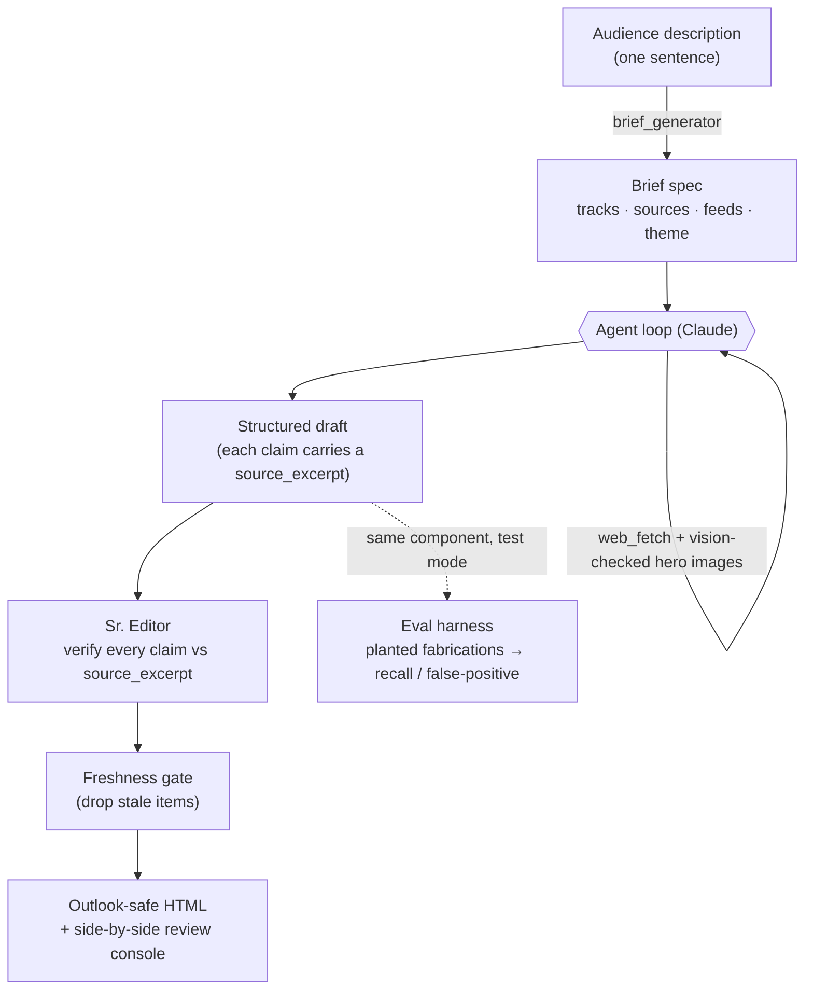

# Newsletter Platform

**Describe an audience in a sentence → get a fact-checked, source-ranked newsletter.**

_I'm a product manager. I wanted a daily brief without reading ten sites every
morning, and I didn't trust an LLM not to quietly make things up. So I built the
fact-checking first and the newsletter around it. Open for anyone with the same
problem. Not a product, not monetized, no signup. Just the thing I use._

A market-intelligence newsletter engine built on Claude. You give it an audience
("AI PMs", "nursing students", "cybersecurity practitioners"); it generates a tailored
editorial brief, sources fresh news from vetted outlets, drafts the issue, **verifies
every claim against quoted source text**, and renders an Outlook-safe email — with a
**fact-checking eval harness** that measures whether the verification actually works.

> The interesting part isn't "an LLM writes a newsletter." It's the **trust machinery
> around it**: claim-level fact verification, a measured eval harness, a curated-source
> allowlist, and a freshness gate — the things that make automated content shippable
> instead of plausible-but-wrong.

<p align="center">
  
  <br><em>A generated issue for "AI PMs" — fact-checked, themed, and rendered as email.</em>
</p>

**▶ Open the live, scrollable samples:**
📄 [Rendered newsletter](https://jungdjh.github.io/newsletter-platform/sample-ai-pms.html) ·
🔍 [Fact-check review console](https://jungdjh.github.io/newsletter-platform/sample-review.html)
&nbsp;·&nbsp; [all samples →](https://jungdjh.github.io/newsletter-platform/)

---

## How it works



The engine is **topic-blind** — what makes it about a given audience is the generated
brief. `brief_generator` turns an audience description into that brief, so the same
pipeline serves any vertical.

| Component | Role |
|---|---|
| `scripts/brief_generator.py` | Audience description → structured brief spec (tracks, sources, feeds, tone, theme). The platform core. |
| `scripts/agent_loop.py` | Claude tool-use loop: research → draft → submit. Owns the web_search allowlist + the self-healing crawler-domain prune. |
| `scripts/tools/feeds.py` | Client-side RSS ingestion — recovers fresh links from outlets the search crawler can't reach. |
| `scripts/candidate_ranker.py` | Cheap Haiku pass that scores feed candidates by audience relevance and keeps the best. |
| `scripts/sr_editor.py` | Second Claude call that fact-checks every claim against its quoted `source_excerpt`. Advisory — the human is the final gate. |
| `scripts/render_html.py` | Outlook-safe, table-based HTML + plaintext. Per-audience palette derived from the brief's theme. |
| `scripts/build_review.py` | Local side-by-side review console (our draft vs. the original article). |
| `tests/evals/` | The fact-checking eval harness. |

---

## What makes it trustworthy (the senior signal)

**1. Claim-level fact verification.** Every Top Story carries a `source_excerpt` — verbatim
sentences from the source. The Sr. Editor verifies each claim in the summary and implications
against that excerpt; anything not supported gets flagged. This is "show your work" enforced
in the pipeline.

**2. A measured eval harness — not vibes.** `tests/evals/` plants known defects into paired
labeled payloads — a faithful story and a fabricated twin that differ by exactly one planted
defect (a number changed, an invented quote, an unstated partner, a shifted deadline) — and
scores the Sr. Editor against ground truth:

```
Fabrication-detection eval — backend=llm, runs=3  (6 paired fixtures)
Recall (fabrications caught):       18/18 = 100%
False-positive rate (clean flagged): 0/18 = 0%
```

The two axes are in tension: a too-eager editor catches everything but flags clean items
(the human stops reading the banner); a too-lax one is quiet but misses fabrications. Because
every fixture is labeled, a prompt change can be **checked for regressions on both axes** instead
of eyeballed.

```bash
make evals       # free baseline backend (numeric heuristic floor, no API key)
make evals-llm   # the real Sr. Editor → writes tests/evals/scorecard.md
```

> Building these fixtures is itself instructive: the editor reviews *holistically* (source
> quality, vendor-PR, freshness — not just fabrication), so a clean false-positive measurement
> requires faithful fixtures that are airtight on everything else. That separation of concerns
> is the kind of thing the harness surfaces.

**3. Sourcing quality at the root, not the filter.** Search is restricted to a per-audience
**allowlist** of vetted outlets (no press-release wires, no SEO blog farms). Where the search
crawler can't reach a quality outlet, **RSS ingestion** recovers it client-side, and a cheap
**relevance ranking** keeps the best candidates — so the writer starts from good inputs.

**4. Freshness discipline.** A cutoff is enforced twice: the writer checks `published_at` on
every fetch, and the orchestration layer drops stale skim items outright.

---

## Quickstart

```bash
pip install -r requirements.txt
export ANTHROPIC_API_KEY=sk-ant-...        # bring your own key

# 1. Generate a brief for any audience:
python -m scripts.brief_generator --audience "indie game developers" --out briefs/indie-devs.json

# 2. Generate + fact-check + render an issue:
python -m scripts.run_newsletter --newsletter indie-devs --demo --save-html out.html

# Zero-API: re-render a saved payload (great for iterating on the design):
python -m scripts.run_newsletter --newsletter ai-pms \
    --from-payload review/ai-pms-ranked.json --skip-editor --demo --save-html out.html
```

Three example briefs ship in `briefs/`: **AI PMs**, **nursing students**, **cybersecurity
practitioners**.

```bash
make test          # full suite, offline, no API key
make evals         # fabrication-detection eval (free baseline)
make review        # build the side-by-side review console
```

---

## How it compares

The popular open-source comparable, [`gpt-newspaper`](https://github.com/rotemweiss57/gpt-newspaper)
(~1.5k★), proves the multi-agent newsletter pattern — but its critique step does **no
fact-checking**, it ships **no tests**, and it isn't production-shaped. This project is built
the other way around: **trust first** — claim verification, a measured eval harness, curated
sourcing, and a tested, replayable pipeline. See
[`docs/design-decisions.md`](docs/design-decisions.md) for the full comparison and the
engineering rationale (cost controls, model choices, the delivery architecture).

## Honest limits

- **Sourcing quality scales with niche-breadth.** Broad audiences (AI PMs, nursing students)
  are well-served by general + trade outlets. *Hyperlocal* audiences (e.g. one school
  district) need hyperlocal sources that general web search barely covers — that's the
  frontier, not a solved problem.
- **Anthropic-only**, by design (this targets the Claude stack).
- **Generate + render, not deliver.** Email delivery and scheduling are intentionally out of
  scope here; the production delivery architecture is described in the design-decisions doc.

## License

MIT — see [`LICENSE`](LICENSE).
